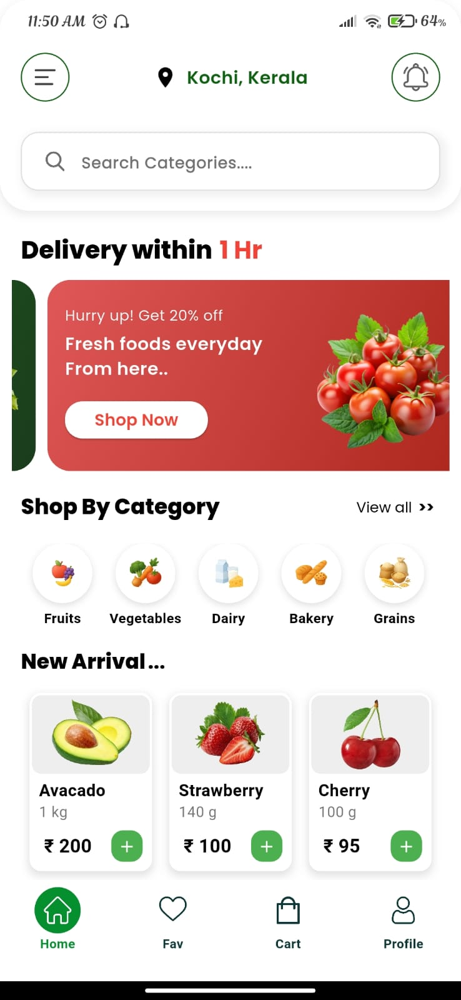
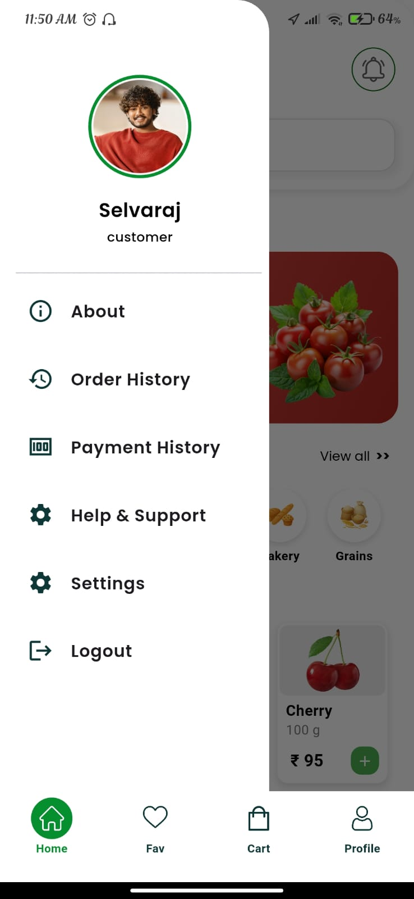
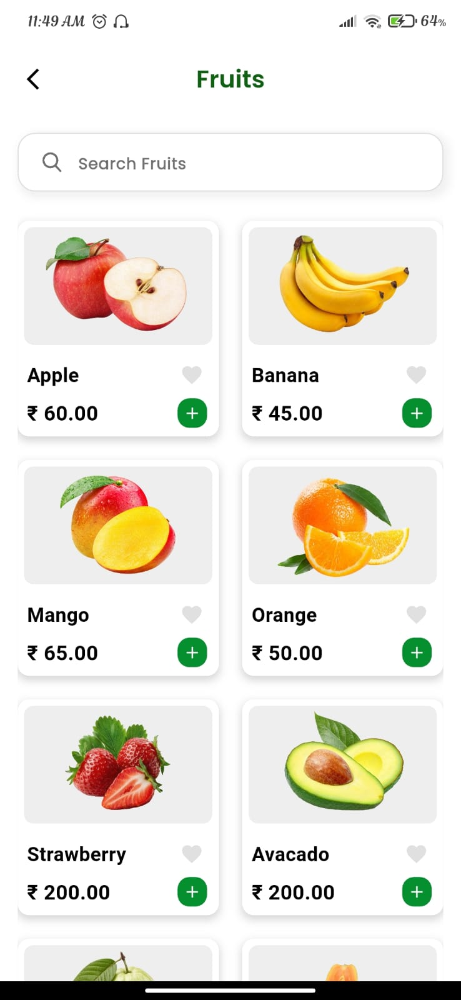
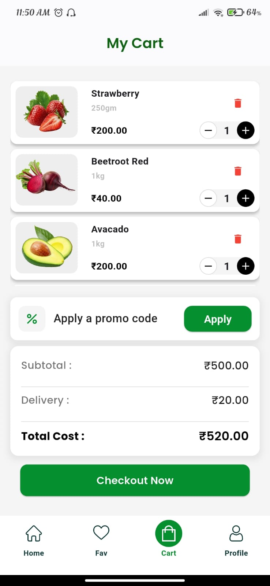
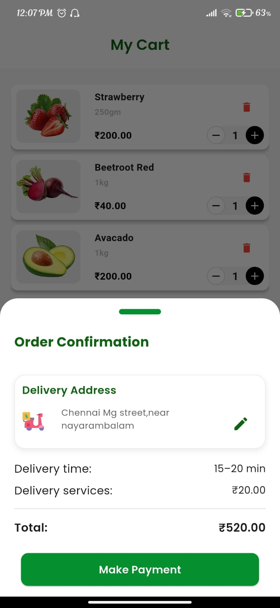

# Rural Mart – Flutter E-Commerce App

Rural Mart is a Flutter-based e-commerce application designed to support **local and rural businesses** by providing a digital platform to browse and manage products efficiently.

---

##  Features

* User authentication (Login / Signup)
* Browse products by categories
* Add to cart functionality
* Persistent cart using SharedPreferences
* Clean and responsive UI
* Simple and smooth navigation

---

##  Tech Stack

* Flutter
* Dart
* Provider (State Management)
* SharedPreferences (Local Storage)

---

##  Architecture

* MVVM / layered structure (UI, Model, Logic separation)
* Custom data models for product handling
* Scalable and maintainable code structure

---

##  Key Highlights

* Implemented state management using Provider
* Created custom models for structured data handling
* Managed local persistence using SharedPreferences
* Built reusable widgets and optimized UI rendering

---

##  Screenshots

  
  
  

  
  
    

  
  
    

---

## 🔗 GitHub Repository

https://github.com/muneervm/Rural_Mart
